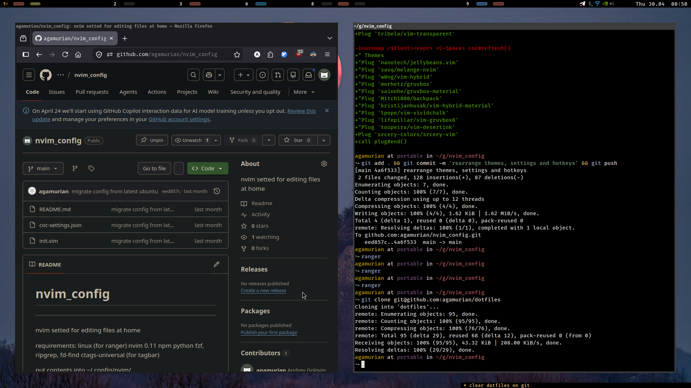
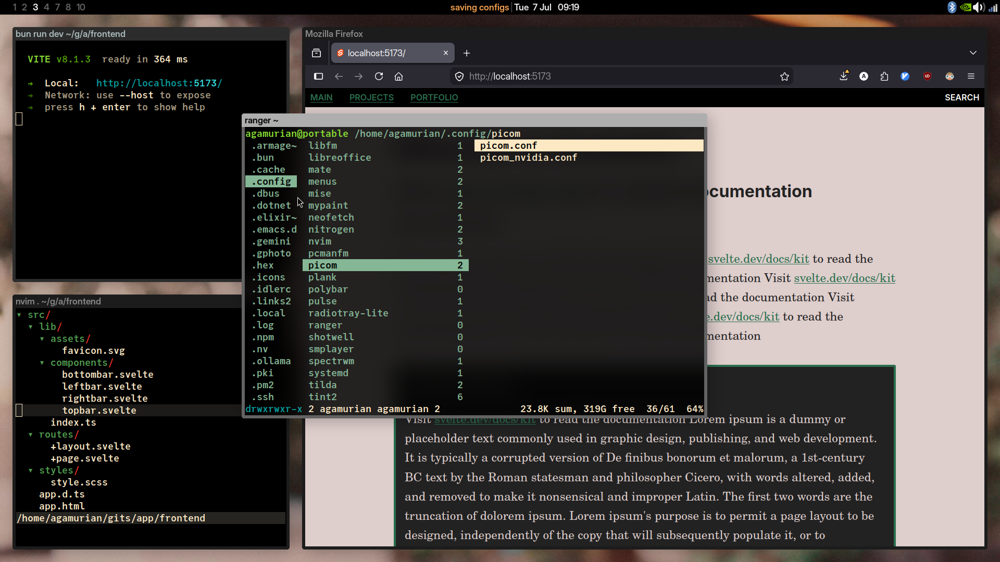

Dotfiles.
---------

I try to keep my settings relatively simple and easy to use.
As with age i get used to certain workflow, it consist of simple, familiar
and tested robust software.

new one in folder new:

with picom:

Base: Ubuntu Mate + i3 (latest LTS)
WM: i3 window manager
Panel: Tint2 panel
Font: Fira Code 

pcmanfm
mate-terminal
firefox
blender, gimp
ranger, fzf, vim, etc

find my simple vim config here:
[nvim_config](github.com/agamurian/nvim_config)

:D on screen you can see me fighting ADHD with my:
[focus_holder](github.com/agamurian/focus_holder)

